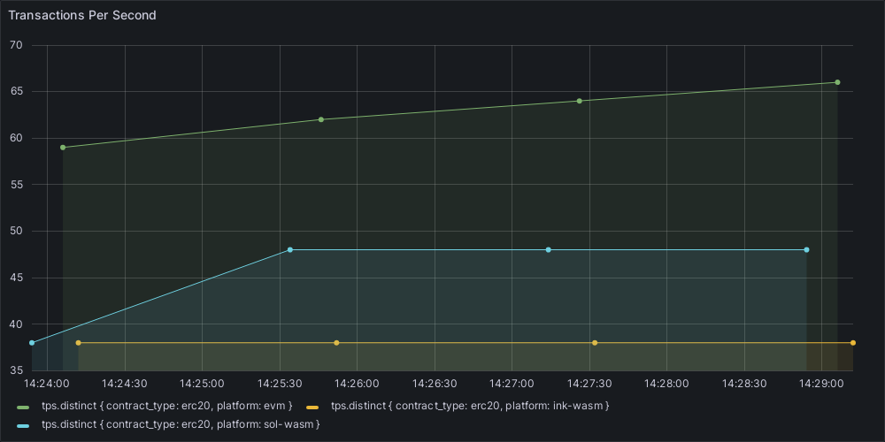

## Overview

This folder contains utilities to create visual graphs based on smart-bench measurements

Solution is based upon Grafana and InfluxDB software. 

### Theory of operation:
1. Script is spinning up ephemeral environemnt with Grafana, Grafana Renderer and InfluxDB services running by utilizing docker-compose.yml configuration
2. Script translates benchmarking data provided in CSV format into Line Protocol format supported by InfluxDB, then uploads it to the InfluxDB service
3. Script is downloading given Grafana panel id (see supported ids beloew) as PNG image by utlizing Grafana plugin pre-configured in the environemnt

### Currently supported panel ids with examples:
- `--panel-id=2` - panel to display transactions per seconds (TPS) measurements per platform, per contract type


## Usage
### `get_graph.sh` help screen:
```
Script to generate PNG graphs out of CSV formatted data from smart-bench via ephemeral Grafana+InfluxDB environment

Usage: ./get_graph.sh ARGS

ARGS
 -p, --panel-id       (Required) ID of the panel within Grafana dashboard to render as PNG
 -c, --csv-data       (Required) CSV formatted output of smart-bench
 -o, --output         (Required) Path to file where output PNG image will be stored
 -h, --help           Print this help message

EXAMPLE
./get_graph.sh --panel-id 2 --csv-data benchmark-result.csv --output tps.png
```

